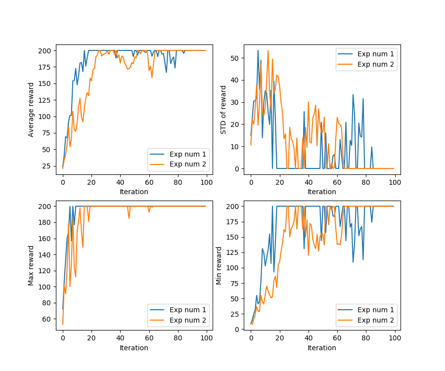

# PolicyGradient_in_tensorflow2.0
Implementation of Policy Gradient in Tensorflow2.0

* This code referenced skeleton code, which is in TensorFlow 1.x, offered in the course [CS294-112 github](https://github.com/berkeleydeeprlcourse/homework/tree/master/hw2)
* Implemented for both continuous and discrete action spaces with reward-to-go option.
* Implemented q function normalization to decrease variation.

## Prerequisites
* python3
* Tensorflow2.0
* Tensorflow_probability (you need to use nightly build to use it in TF2.0)
* numpy
* gym 

## Example Usage

### Training
	$ python PG_in_tf2.0.py InvertedPendulum-v2 --exp_name Test_cont --seed 1
	$ python PG_in_tf2.0.py CartPole-v0 --exp_name Test_disc --seed 1

### Plotting
	$ python plot.py Data/your_exp_name
	$ python plot.py Data/your_exp_name -f

## Example Result
CartPole-v0
iteration : 100
number of experiments : 2

## Author

Wonjun Son / [Github](https://github.com/wongongv)